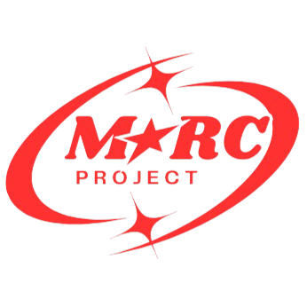

<!-- Bonjour, nous avons choisi de rédiger notre fichier README en format Markdown (pour faire pro !). Par consèquent, il sera plus simple et surtout plus agréable à visualiser depuis GitHub ou depuis votre IDE préféré (CLion par exemple). Merci et bonne consultation ! -->

<h1 align="center">
  <br>
  <a href=""></a>
  <br>
  Mission MARC par Thomas, Noé & Adrien
  <br>
</h1>

<p align="center">
  <a href="#Présentation-du-projet">Présentation</a> •
  <a href="#Comment-utiliser">Comment utiliser</a> •
  <a href="#Télécharger">Télécharger</a> •
  <a href="#crédits">Crédits</a> •
</p>

## Présentation du projet
CONTEXTE :

Le projet a pour objectif de permettre à MARC, un rover ayant été victime d'un dysfonctionnement sur MARS, de rentrer à une station base pour pouvoir se faire réparer. 
Il a toujours son radar et son gyroscope pour lui permettre de se situer. 
Il se repère donc par sa position et sa direction , parmi Nord, Sud, Est et Ouest. N'ayant plus qu'un nombre limité de mouvement (9 mouvements restants), MARC ne peut qu'en choisir 5 pour pouvoir rentrer à la base. 
On a donc programmé le « meilleur choix possible » de déplacement, afin qu'il se rapproche au mieux de la base.

FONCTIONALITES :

Voici les fonctionnalités réalisées (dans les fichiers de même nom) :

tree : 
- Définition de la structure de l'arbre et des noeuds 
- Création d'un noeud 
- Construction d'un arbre n-aires 
- Recherche de la valeur minimale de tout l'arbre

node_queue : 
- Création d'une fonction de file pour les noeuds 
- Création d'une file vide 
- Ajout d'un noeud dans la file 
- Retirer un noeud de la file

path : 
- Recherche de la feuille de valeur minimale 
- Parcours en largeur pour trouver tous les noeuds ayant la valeur minimale 
- Calcul du coût total du chemin pour arriver à chaque noeud minimal 
- Choix du noeud ayant le coût optimal 
- Définition du chemin optimal 
- Définir les mouvements à effectuer pour avoir le parcours le plus optimal

## Comment utiliser

Pour utiliser notre projet, rien de plus simple ! Il vous suffit de suivre quelques étapes relativement faciles :
- Téléchargez ou clonez le code source : Assurez-vous d'avoir la dernière version mise à jour de notre code source sur votre machine. Vous pouvez le télécharger depuis GitHub, voir : <a href="#télécharger">Télécharger</a>, ou si vous avez git vous pouvez cloner notre projet via un invite de commande comme détaillé ci-dessous.
- Exécutez le code : Après avoir téléchargé et éventuellement décompressé le dossier avec les éléments de notre projet, vous pouvez exécuter le code source du projet. Vous devrez chercher le fichier principal du projet, "main.c". Pour l'exécuter, vous avez plusieurs possibilités :
    - Utiliser un IDE : ouvrir le répertoire du projet dans un IDE (comme CLion par exemple), cliquer sur le fichier "main.c" et l'exécuter. Le code sera exécuté directement dans la console de votre IDE préféré.
    - Utiliser un terminal : depuis un terminal, naviguer jusqu'au répertoire du projet à l'aide de la commande "cd", puis tapez "gcc -o marc main.c && ./marc". Le code sera exécuté directement dans votre terminal, ce qui peut être avantageux si vous utilisez un système d'exploitation Linux.


```bash
# Cloner le projet depuis GitHub
$ git clone https://github.com/Adri1-rvt/MARC-Project

# Aller dans le répertoire du projet
$ cd (nom du dossier decompresse)

# Compiler le code
$ gcc -o marc main.c

# Exécuter notre magnifique projet
$ ./marc
```

> **Note**
> Selon votre système d'exploitation ou le terminal utilisé, les commandes peuvent être légèrement différentes.

Une fois le code lancé, laissez-vous guider par notre intuitive (et magnifique) interface !

## Télécharger

Vous pouvez [télécharger](https://github.com/Adri1-rvt/Mission-MARC) la dernière version du programme de MARC pour Windows, MacOS et Linux via GitHub.
<br>Pour cela, ouvrez le lien ci-dessus, puis cliquez sur le bouton vert en haut à droite de la page GitHub "Code".
Sélectionnez ensuite "Download ZIP".
<br>Une fois votre fichier ZIP téléchargé, il ne vous reste plus qu'à le décompresser (avec WinRaR ou un tool natif de votre OS par exemple) pour pouvoir utiliser le code source !

## Compatibilité
| Windows | MacOS |   ChromeOS   |   Linux    | 
|:-------:|:-----:|:------------:|:----------:| 
|   Compatible   |  Compatible  | Incompatible | Compatible |
> **Note**
> Minimum version requise de CMake pour la bonne exécution du programme : VERSION 3.27

## Crédits

Ce logiciel a été développé par :

- Adrien RIVET (adrien.rivet@efrei.net)
- Noé MOOS DEGOUTIN (noe.moos-degoutin@efrei.net)
- Thomas BOTTALICO (thomas.bottalico@efrei.net)

N'hésitez pas à nous contacter par mail si vous avez besoin d'informations !
<br>Merci à notre prof Mr. LANDSCHOOT qui nous a aidé dans la réalisation de ce projet.
